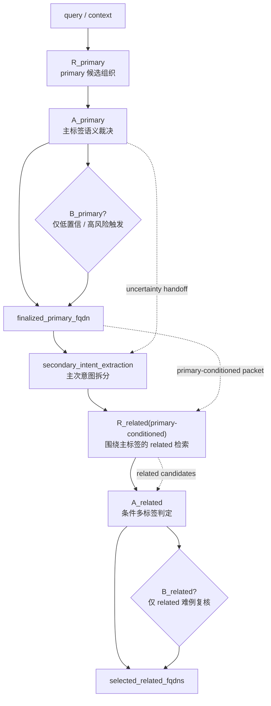
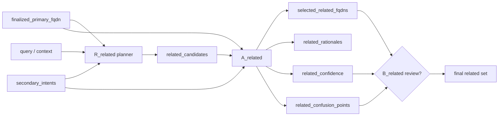

# Related v2 架构设计（2026-04-01）

> 目的: 将 `related` 从当前与 `primary` 近似共用的 `R -> A -> B` 对称链中拆出来，改成“主标签条件下的独立 retrieval + adjudication”子系统。
>
> 设计结论:
> - `primary` 继续保留现有 `R_primary -> A_primary -> B_primary`
> - `related` 不建议改成裸 `A -> B`
> - 正确方向是:
>   - `A_primary`
>   - `intent split / secondary extraction`
>   - `R_related(primary-conditioned)`
>   - `A_related`
>   - `B_related` 仅作低频复核

## 1. 背景与问题

当前 `related` 线的失败不是单点问题，而是两层结构性问题叠加:

1. `Stage R` 对 `related` 的候选覆盖不足
   - 以 `holdout3` 为例，`Stage R` 的:
     - `PrimaryRecall@10 = 0.97`
     - `RelatedCoverage@10 = 0.3897`
   - 说明 `primary` 候选召回已经足够强，但 `related` 候选池本身明显偏薄。

2. `Stage A / B` 当前把 `related` 当成 `primary` 裁决的副产品
   - 即:
     - 先选 primary
     - 再从同一包候选里顺手挂 `selected_related_fqdns`
   - 这会导致:
     - `related` 与 `primary` 共享错误边界
     - secondary intent 被 incumbent/top challenger 的主裁决逻辑压住
     - `Stage B` 对 `related` 基本没有独立增益

因此，`related` 当前不适合继续按“与 `primary` 完全对称”的阶段架构来做。

## 2. 当前主判断

### 2.1 不建议继续的做法
- 不建议继续让 `related` 与 `primary` 共用同一候选包、同一 decision packet
- 不建议仅靠再调 `Stage B` prompt / temperature / gate 去修 `related`
- 不建议改成完全去掉 retrieval 的裸 `A -> B`
  - 原因:
    - namespace 搜索空间过大
    - related 本质仍是“候选召回 + 多标签判定”问题
    - 没有 retrieval，`A/B` 只能靠自由生成，风险更高

### 2.2 建议采用的做法
- `primary` 与 `related` 分成两条职责不同的子链:
  - `primary`: 单标签主决策
  - `related`: 主标签条件下的补充标签检索与多标签判定

一句话:

> `related` 不该继续和 `primary` 共用同一条对称链，
> 但也不该变成无检索的裸 `A -> B`；
> 它应当成为“主标签条件下的二阶段 related 子系统”。

## 3. Related v2 总体结构

### 3.1 Primary 主线保持不变
- `R_primary`
- `A_primary`
- `B_primary`

Primary 主线继续负责:
- 主任务标签选择
- 可接受主标签判断
- primary 相关的不确定性升级

### 3.2 Related 子线独立
- `A_primary` 输出主标签后，进入 `related` 子线:

```text
query/context
  -> R_primary
  -> A_primary
  -> (optional) B_primary
  -> finalized_primary
  -> secondary_intent_extraction
  -> R_related(primary-conditioned)
  -> A_related
  -> (optional) B_related
  -> selected_related_fqdns
```

### 3.2.1 总体架构流程图



### 3.2.2 `related` 子线细化图



### 3.3 关键变化
- `related` 不再从 `primary` 的同一包 candidate 中“顺手挑”
- 而是围绕:
  - `finalized_primary`
  - `secondary intents`
  - `cross-domain related policy`
  重新构造一个更贴 `related` 任务的候选池

## 4. 模块定义

## 4.1 `secondary_intent_extraction`

### 输入
- 原始 `query`
- `context`
- `A_primary` 的:
  - `primary_rationale`
  - `secondary_rationale`
  - `confusion_points`
  - `uncertainty_summary`

### 输出
- `secondary_intents`
  - 每个 secondary intent 是短语级语义槽，而不是 fqdn
- `primary_secondary_split`
  - 说明哪些片段属于 primary，哪些属于 secondary
- `secondary_confidence`

### 作用
- 把“用户还顺手想做什么”显式化
- 让后续 `R_related` 不再只是复用 `R_primary` 的 top-k 候选

## 4.2 `R_related(primary-conditioned)`

### 输入
- `finalized_primary_fqdn`
- `secondary_intents`
- 原始 `query/context`

### 输出
- `related_candidates`
- `related_candidate_trace`

### 设计原则
- 召回来源应与 `R_primary` 区分:
  - `primary` 邻域候选
  - sibling / complement candidates
  - policy-allowed cross-domain complements
  - descriptor / alias 命中到的非 primary 邻接功能

### 与当前 `Stage R` 的区别
- 当前 `Stage R` 主要为 primary 建候选，并顺带带出部分 relevant nodes
- `R_related` 则是:
  - **围绕已知 primary 的条件检索**
  - 不是泛 namespace 的第二次主检索

## 4.3 `A_related`

### 输入
- `finalized_primary_fqdn`
- `secondary_intents`
- `related_candidates`

### 输出
- `selected_related_fqdns`
- `related_rationales`
- `related_confidence`
- `related_confusion_points`

### 核心任务
- 判断某候选是否:
  - 是 secondary / complement
  - 仅与 query 共现但不应挂 related
  - 实际应该是另一个 primary challenger

### 与 `A_primary` 的本质区别
- `A_primary` 是单标签主决策
- `A_related` 是条件多标签判定

## 4.4 `B_related`

### 定位
- 不作为每条样本的必经阶段
- 仅在低置信、高风险、跨域 secondary 难例上触发

### 主要职责
- 对 `A_related` 的低置信结果复核
- 对 cross-domain related 进行保守审计
- 防止:
  - 误挂 unrelated
  - 将 primary challenger 错挂成 related

### 触发建议
- `related_confidence` 低
- `cross_domain_secondary_ok` 不确定
- 出现 `primary_vs_secondary_ambiguous`
- `high_risk` 与 secondary 同时出现

## 5. packet 与证据设计

## 5.1 `R_related` 候选卡应新增
- `complement_to_primary`
- `same_session_secondary_fit`
- `cross_domain_secondary_ok`
- `duplicate_chain_risk`
- `can_only_be_related`

## 5.2 `A_related` 应显式输出
- `why_related_not_primary`
- `secondary_anchor_strength`
- `depends_on_primary`
- `reject_reason_if_not_selected`

## 5.3 `B_related` 的 prompt 原则
- 继续候选内约束
- 强调:
  - “这不是主标签改判任务”
  - “优先判断 secondary 是否成立”
  - “若 candidate 更像 primary challenger，应拒绝挂 related”

## 6. 与现有主线的关系

### 6.1 可以复用的部分
- `A_primary` 的 uncertainty handoff
- 当前 packet v2 中的部分语义字段
- `Stage B` 的 trace / audit 框架

### 6.2 必须独立的部分
- `related_candidates`
- `related_decision_packet`
- `B_related` 触发条件

### 6.3 不建议复用的部分
- primary 的同一 top-k candidate 包
- primary 的 override gate
- `Stage B primary` 的角色职责直接平移到 `related`

## 7. 最小实现方案

### Phase 1: `related` 从 primary packet 中拆包
- 保留现有 `R_primary / A_primary / B_primary`
- 新增:
  - `secondary_intent_extraction`
  - `related_decision_packet`

### Phase 2: 实现 `R_related(primary-conditioned)`
- 用 primary-conditioned 检索构造 related candidate pool
- 目标先看:
  - `RelatedCoverage@k`
  - `RelatedRecall@Covered`

### Phase 3: 实现 `A_related`
- 将 `related` 从“顺手挂”改成“显式判定”
- 观察:
  - `decision_related_miss`
  - `decision_related_overpredict`

### Phase 4: 低频加入 `B_related`
- 只复核最难的 secondary 样本
- 不再要求 `B_related` 像 `B_primary` 一样高覆盖

## 8. 评测建议

### 8.1 不再只看全局 `RelatedRecall / Precision`
应新增分层指标:
- `R_related Coverage@k`
- `A_related Recall@Covered`
- `B_related correction gain`

### 8.2 推荐误差桶
- `related_retrieval_miss`
- `related_decision_miss`
- `related_overpredict`
- `primary_challenger_miscast_as_related`
- `cross_domain_secondary_false_positive`

### 8.3 报告口径
- `primary` 与 `related` 分开报告
- 不再用一张总表掩盖 `related` 的 retrieval 问题

## 9. 对论文与答辩的意义

这套设计最重要的价值，不是立刻替换当前已冻结主线，而是:
- 解释为什么 `related` 现阶段效果差
- 给出一个与现有实验结论一致的后续架构方向

对外建议表述为:

> 当前系统已在 `primary` 可信认知标识上完成主线收口；
> 对于 `related`，实验表明其主要瓶颈不在多智能体运行时参数，而在 secondary-aware retrieval 与多标签 adjudication 机制尚未独立建模。
> 因此后续将把 `related` 从对称主链中拆出，建设主标签条件下的专门 related 子系统。

## 10. 最终判断

- `related` 不适合继续照搬现在这套对称 `R -> A -> B`
- `related` 也不适合改成裸 `A -> B`
- 正确方向是:
  - `primary` 主线保持
  - `related` 改成 `primary-conditioned retrieval + multi-label adjudication + optional review`
