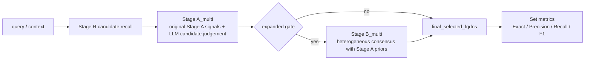

# 多意图集合路由新增路线设计

## 设计边界

本路线作为 `multi_intent_eval_v1` 的扩展实验链路新增，不替换已经冻结的 primary 路由主线。算法口径是“原 Stage A/Stage B 的多输出扩展”，不是另起一条简化的候选集合选择器。

- 冻结主线继续使用 `Stage R -> Stage A primary -> Stage B primary consensus`。
- 多意图路线使用 `Stage R -> Stage A_multi calibrated set selection -> Stage B_multi heterogeneous set consensus`。
- 多意图指标只评估 `final_selected_fqdns[]` 与 `gold_intent_fqdns[]` 的集合一致性。

## 流程



## Stage A_multi

Stage A_multi 不再把输出限制为一个 primary，但内部仍沿用原 Stage A 的候选证据和校准逻辑：

- 先运行原 `StageACleanConfig` 得到 `score_a`、`score_related`、候选角色、margin、confidence 和 escalation reasons。
- LLM 不直接“凭感觉给最终答案”，而是对每个候选输出 `task_fit`、`select_fit`、粒度判断、风险错配、证据支持和证据反对。
- 系统将原 Stage A 分数、Stage R 分数、LLM 逐候选裁决和粒度/风险约束融合为 `score_set`。
- 单意图 query 正常返回长度为 1 的 `selected_fqdns[]`；多意图 query 返回所有明确提出的目标 FQDN。
- expanded gate 根据集合边界、置信度、多意图欠选、高风险和 LLM 不确定性决定是否进入 Stage B_multi。

实现入口：

- `src/agentdns_routing/stage_a_multi_intent.py`
- `scripts/run_stage_a_multi_intent.py`

## Stage B_multi

Stage B_multi 对 Stage A_multi 的集合结果做异构多智能体审查。进入条件采用 expanded gate，而不是只依赖 Stage A LLM 自报 `escalate_to_stage_b`。角色包括：

- `DomainExpert`
- `GovernanceRisk`
- `HierarchyResolver`
- `UserPreference`

每个 reviewer 输出 `proposed_selected_fqdns`、`keep_fqdns`、`add_fqdns`、`remove_fqdns`。系统按 Stage A 校准先验、支持票、移除票、reviewer 置信度和 Stage R 分数聚合，得到 `final_selected_fqdns[]`。当集合边界接近时，可触发第二轮只复核边界候选。

实现入口：

- `src/agentdns_routing/stage_b_multi_intent.py`
- `scripts/run_stage_b_multi_intent.py`

## 与原 related_v2 的关系

在多意图集合任务中，`related_v2` 不再作为正式链路的一部分。原 `related_v2` 可以作为 primary 主线的辅助输出或历史对比，但多意图任务的正式预测应直接来自：

```text
final_selected_fqdns[]
```

## 评估

集合评估脚本已经支持新字段：

- `scripts/evaluate_multi_intent_set_routing.py`

优先读取顺序：

- `final_selected_fqdns`
- `stage_b.final_selected_fqdns`
- `stage_a.selected_fqdns`
- 旧兼容字段 `primary + related`

推荐正式实验命令：

```bash
python3 scripts/run_stage_a_multi_intent.py \
  --input data/agentdns_routing/formal/multi_intent_eval_v1.jsonl \
  --snapshot artifacts/stage_r_clean/multi_intent_eval_v1_deepseek_chat_v3_20260426/multi_intent_eval_v1.sr_clean_v0_20260306.jsonl \
  --output-dir artifacts/routing_ab/multi_intent_eval_v1_multi_set_v2_deepseek_chat_20260426 \
  --provider deepseek \
  --model deepseek-chat \
  --gate-mode expanded
```

```bash
python3 scripts/run_stage_b_multi_intent.py \
  --input data/agentdns_routing/formal/multi_intent_eval_v1.jsonl \
  --traces artifacts/routing_ab/multi_intent_eval_v1_multi_set_v2_deepseek_chat_20260426/multi_intent_eval_v1.stage_a_multi_intent_v2_20260426.jsonl \
  --output-dir artifacts/stage_b/multi_intent_eval_v1_multi_set_v2_deepseek_chat_20260426 \
  --provider deepseek \
  --model deepseek-chat \
  --collaboration-mode heterogeneous \
  --gate-mode expanded
```

```bash
python3 scripts/evaluate_multi_intent_set_routing.py \
  --input data/agentdns_routing/formal/multi_intent_eval_v1.jsonl \
  --output-dir artifacts/routing_ab/multi_intent_eval_v1_multi_set_v2_deepseek_chat_20260426/eval \
  --trace a_multi=artifacts/routing_ab/multi_intent_eval_v1_multi_set_v2_deepseek_chat_20260426/multi_intent_eval_v1.stage_a_multi_intent_v2_20260426.jsonl \
  --trace b_multi=artifacts/stage_b/multi_intent_eval_v1_multi_set_v2_deepseek_chat_20260426/multi_intent_eval_v1.stage_b_multi_intent_v2_20260426_hetero.jsonl
```
