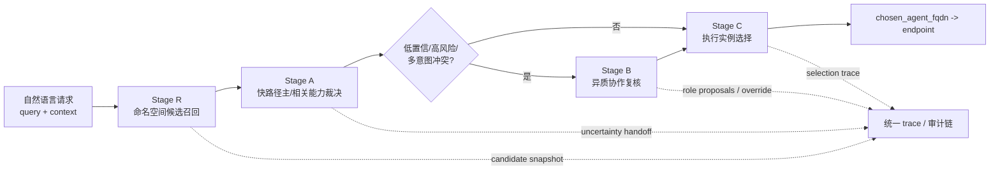
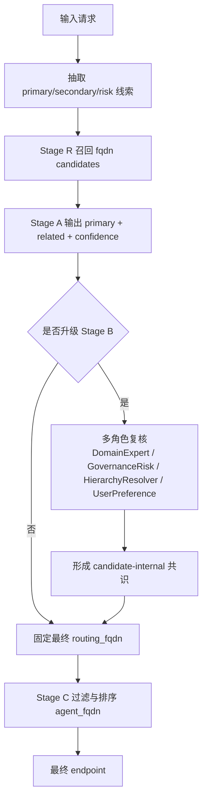
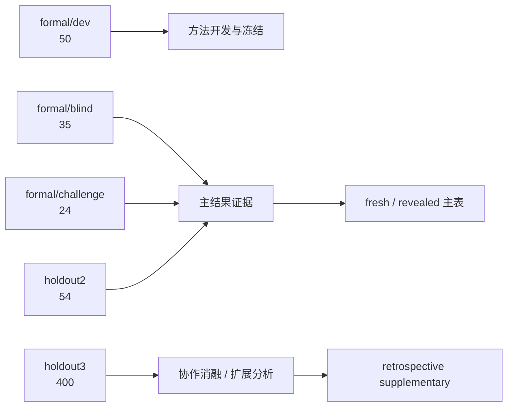

# 面向互联网基础资源的大模型多智能体协作与可信认知标识技术研究

## 技术研究报告

版本：`v0.2`  
日期：`2026-04-06`

## 摘要

面向互联网基础资源场景的智能体服务正在从静态资源标识走向能力标识、语义寻址与可信调用。然而，自然语言请求往往同时包含主任务、辅助诉求、风险限制和行业语境，单一大模型在这类受约束语义路由任务上容易出现三类问题：一是单视角判断导致覆盖不足，二是复杂样本上的决策波动较大，三是过程缺乏结构化留痕，难以解释和复核。针对上述问题，本文提出一套面向智能体命名与语义路由的多阶段协作框架。该框架以能力命名空间为统一语义底座，将路由过程划分为命名空间候选召回、快路径裁决、慢路径异质协作复核和下一跳执行选择四个阶段，并在全过程中记录可回放的结构化 trace，以支撑错误归因、结果解释和工程审计。

围绕真实标签驱动的验证需求，项目构建了覆盖 9 类领域、25 个能力基座的路由数据资产，其中 formal 主评测集包含 `dev=50`、`blind=35`、`challenge=24` 三个 split，另建设 `holdout2=54` 条 fresh 样本和 `holdout3=400` 条独立扩展样本。实验结果显示，deterministic 的 `Stage A clean` 已形成稳定 fast-path 基线，但在 fresh holdout 上泛化能力有限；引入不确定性下传机制的 `Stage A llm v2` 成为当前更强的主裁决线，在 blind、challenge 和 holdout2 上均明显优于 `A_clean`；异质协作 `Stage B` 则在 challenge 与部分 holdout 场景中提供了选择性的正向修正，但尚未证成对所有 split 的统一稳定增益。进一步的 retrospective 分析表明，职责化 gate 与异质协作仍存在可观提升空间，但该部分结果不应替代 fresh 主表解释。总体而言，本文完成了“能力命名空间、路由原型、多批次验证和结构化可信留痕”的最小闭环，为结项验收、后续论文和专利材料提供了统一技术基础。

*图 1. 系统总体架构。系统将语义路由拆解为候选召回、快路径裁决、慢路径复核与执行选择四个阶段，并对全过程保留结构化 trace。*

## 1. 引言

随着大模型和智能体系统逐步进入互联网基础资源相关场景，系统处理对象已不再只是传统的人类可读资源，而是越来越多地转向可调用能力、服务实例和带约束的任务入口。在这一背景下，一个核心问题日益突出：当用户以自然语言提出请求时，系统如何稳定地将其映射为正确的能力地址，并进一步选择合适的执行实例？这个问题看似类似通用意图分类，但在实际系统中要复杂得多。请求文本中不仅可能同时包含主任务和次要诉求，还可能出现层级粒度竞争、跨域语义重叠、治理或合规约束，以及由行业语境带来的偏置信号。对于这类任务，直接让单一大模型一步输出结果，往往会得到一个“能回答但不够稳”的系统：简单样本上表现尚可，但一旦进入同层级竞争、父子节点冲突或高风险边界样本，错误率和波动性都会显著上升。

更关键的是，单模型直接裁决还带来工程上的第二个问题。系统能够给出一个结果，但很难说明这个结果是如何形成的。它为何选择某个主能力、为何没有选择另一个竞争候选、为何在某些样本上触发了慢路径复核，又为何在另一些样本上保持原判，这些问题如果没有结构化过程记录，就很难在内部评审、错误复盘或外部答辩中获得令人信服的解释。对于互联网基础资源相关系统而言，“结果正确”固然重要，但“过程可复核、边界可说明、责任可追踪”同样重要。

基于上述背景，本文尝试将问题重新表述为一个受约束的语义路由问题，而不是一个单轮的开放式问答问题。系统不再直接在开放空间里生成答案，而是在固定能力命名空间内先召回候选、再做候选内裁决，并仅在必要时引入慢路径的异质协作复核。进一步地，系统将能力寻址与实例发现解耦：前者回答“哪一类能力应当处理这个请求”，后者回答“由哪个具体实例执行该能力”。这一分层设计使问题具备更明确的结构边界，也更适合工程化评测。

本文的核心贡献有三点。第一，提出并实现了一套面向智能体命名与语义路由的四阶段框架，将候选召回、快路径裁决、异质协作复核和下一跳执行选择统一到一条可运行链路中。第二，在快路径与慢路径之间引入结构化的不确定性下传机制，使慢路径复核不再只看到压缩分数，而是看到带有竞争语义、负证据和 override 敏感性的候选包。第三，在全过程中建立统一的 trace contract，使系统在输出结果的同时保留可回放、可归因、可审计的过程证据。

需要说明的是，本文并不把所有结果都包装成“已经彻底验证的最终方法”。相反，我们有意区分 fresh 主结果与 retrospective 补充结果，并明确指出哪些结论已经稳定、哪些仍属继续打磨中的探索性发现。我们认为，这种边界清晰的表达方式比单纯追求更高数字更适合当前阶段的技术研究报告。

## 2. 相关工作与问题定位

大模型推理增强研究已经提供了多个与本文相关的重要方向。`Chain-of-Thought` 与 `Self-Consistency` 证明了单模型多路径推理和一致性聚合能够显著提升复杂推理表现，但这一路线主要面向通用 reasoning，默认输出空间是开放的，不直接处理能力命名、候选内约束和主次意图区分问题。`Tree of Thoughts` 则将推理过程显式扩展为树搜索，强调回溯与多路径探索，为“不要只看一条推理路径”提供了更系统的视角，但其工程关注点仍偏向通用搜索式思考，而不是互联网基础资源语义路由中的层级粒度冲突和执行落点问题。

多智能体辩论与 committee 类方法为本文提供了另一条启发路径。这类工作通常通过多模型、多人格或多角色实例的讨论与投票来提升 factuality 和 reasoning 质量，其优势在于为系统引入多视角竞争。然而，已有多数方法要么强调开放式讨论，要么强调最终投票结果，并没有严格限制输出必须来自同一候选集合，也较少与 fresh/blind/holdout 这类严谨的数据治理协议结合。换言之，已有多智能体方法告诉我们“多视角有价值”，但没有直接回答“如何在固定命名空间候选内做可审计的主次能力裁决”。

此外，`Constitutional AI` 和 AI feedback 路线表明，规则和反馈信号能够有效塑造模型行为边界。这与本文中的高风险治理约束、主次意图分离和 override 敏感性设计密切相关。不过，这些工作更偏向 general alignment，而非特定场景下的能力寻址与执行发现。本文从中借鉴的重点不是“让模型更安全”这一宏大目标，而是“把反馈与约束显式嵌入受限决策流程”这一方法论。

因此，本文的定位并不是重新提出一个更通用的 debate 系统，而是面向互联网基础资源场景中的语义路由任务，构建一条结构更清晰、边界更严格、过程更可回放的工程化协作链路。相比“开放空间里讨论哪个答案更好”，本文更关注“固定候选集内如何稳健选出正确的主能力，并将辅助能力与执行实例区分清楚”。

## 3. 方法

### 3.1 统一语义对象与问题表述

本文首先定义两类核心语义对象。`routing_fqdn` 用于表示能力地址，是系统主评测的输出对象；`agent_fqdn` 用于表示实例地址，是下一跳执行选择的输出对象。二者的区别在于，前者强调稳定语义，后者强调具体执行。通过将能力地址与实例地址分层表示，系统能够在保持命名空间稳定的前提下适应执行实例的动态变化。

在这一表述下，输入是自然语言请求及可选上下文，输出则包含三个部分：主能力地址、相关能力地址列表，以及在需要执行时的候选实例排序与最终执行落点。为了保证评测公平性，方法设计坚持 `candidate-internal` 原则，即快路径与慢路径都只能在 `Stage R` 已召回的候选集合内进行裁决，不允许下游模块凭空发明候选外路由。这一约束的意义在于把系统错误明确拆解为“召回错误”与“候选内选择错误”，从而使分析和改进都有清晰对象。

### 3.2 Stage R：命名空间候选召回

`Stage R` 的任务是在能力命名空间中为每个输入组织一个高质量候选集合。当前系统采用 descriptor-only 的 clean recall 思路，不读取含有潜在泄漏风险的样例资源，而主要依赖节点描述、别名、层级信息以及若干元数据标签进行词法与元数据融合召回。这个设计看起来保守，但它有两个直接好处。第一，候选集合的来源更干净，适合作为后续 blind 和 holdout 评测的稳定底座。第二，一旦 ground truth 没有被召回，系统可以明确将其归类为 `stage_r_miss`，而不是让下游模块用更复杂的逻辑将问题掩盖过去。

当前版本 `sr_clean_v2_20260314_related2` 在 `dev` 上已经达到 `PrimaryRecall@10=1.0000` 和 `RelatedCoverage@10=1.0000`，在 blind 与 challenge 上也保持较高覆盖率。这意味着在当前语义路由任务下，召回层已经不再是主瓶颈，后续增量主要来自候选内的判断质量。

### 3.3 Stage A clean：规则化快路径

`Stage A clean` 是系统的 deterministic fast-path。它接收 `Stage R` 输出的候选集合，在不发明新候选的前提下，对所有候选进行受约束排序，并输出 `selected_primary_fqdn`、`selected_related_fqdns`、候选排序以及整体置信度。其设计重点不是“尽可能复杂”，而是“尽可能稳”。因此，它更多依赖显式的分数融合、层级与风险约束以及可解释的 margin 判据，而不是让模型在开放语境下自由发挥。

这一版本的意义在于为系统提供一个高可解释、低波动、低成本的基线。它在 `dev` 上已经闭环到 `1.0000`，说明对开发集内的语义边界已经有较好刻画。但 blind 与 holdout2 结果表明，deterministic fast-path 仍然受限于人工规则与固定语义模板，尤其在 fresh 场景中难以稳定处理复杂竞争关系。因此，它更适合被定位为工程 fast-path，而不是最终主方法。

### 3.4 Stage A llm v2：结构化不确定性下传

为了突破 deterministic 路径在 fresh 场景中的上限，系统进一步实现了 `Stage A llm v2`。与早期“让大模型直接选一个答案”的思路不同，这一版本更强调将模型的判断过程结构化，并把不确定性显式传递给下游慢路径。具体来说，`Stage A llm v2` 除了输出主能力、相关能力和置信度之外，还会同时生成 `primary_rationale`、`secondary_rationale`、`challenger_notes`、`uncertainty_summary`、`confusion_points` 和 `override_sensitivity` 等字段。

这些字段的价值在于，它们不是冗长的自由推理文本，而是受约束的短语义卡片。它们告诉系统：当前主能力为什么成立，哪些 challenger 之所以有竞争力，模型真正困惑的点是什么，以及在什么条件下允许慢路径改判。这样一来，`Stage B` 看到的就不再只是一个“top1 比 top2 高 0.03”的压缩数值，而是一组带有任务语义、负证据和竞争簇信息的结构化 packet。实践证明，这种语义增强是 `Stage B` 能否产生有效修正的关键前提。

### 3.5 Stage B：异质协作慢路径复核

`Stage B` 的引入并不是为了让系统在所有样本上都“再想一遍”，而是为了在低置信、margin 过小、高风险或多意图冲突样本上进行更谨慎的复核。当前主线版本采用异质角色协作，包括 `DomainExpert`、`GovernanceRisk`、`HierarchyResolver` 和 `UserPreference` 等角色。它们并不是为了制造形式上的多样性，而是分别对应任务语义匹配、治理与风险边界、层级粒度冲突以及主次意图拆分这几类最常见的错误来源。

值得强调的是，`Stage B` 仍然严格坚持候选内决策边界。它不能发明候选外新路由，也不能用更激进的改判去掩盖 `Stage R` 的召回错误。其真正作用，是在已有候选集内部更谨慎地判断 incumbent 是否应维持原判，challenger 是否真的拥有足够证据完成 override，以及某个候选更适合成为 primary 还是 related。从工程上看，`Stage B` 更像一个高精度慢路径审查器，而不是一个另起炉灶的第二路由器。

### 3.6 可信认知标识与结构化 trace

本文对“可信”的使用保持克制。当前系统实现的不是强密码学意义上的不可否认性，而是工程上可审计、可回放、可归因的结构化行为链。每个样本在 `Stage R`、`Stage A`、`Stage B` 和 `Stage C` 中的输入、输出、候选、置信度、升级原因、角色提案和最终来源都会被写入统一 contract 下的 trace。这样一来，系统不仅能回答“最终结果是什么”，还可以回答“为什么是这个结果”，“如果错了，是召回错、判断错还是 related 恢复错”，以及“某次慢路径改判究竟由哪个角色的证据驱动”。

这种 trace 机制对当前项目的意义是双重的。一方面，它直接服务于内部评审、错误分析和答辩展示；另一方面，它也为后续加入 hash-chain、篡改检测等更强机制提供了数据结构基础。当前阶段，我们将这部分贡献准确界定为“结构化审计能力”，而不夸大为“已经完成强安全可信证明”。

### 3.7 Stage C：下一跳执行选择

在能力地址裁决之后，系统还需要将 `routing_fqdn` 落到具体执行实例。为此，项目在仓库中实现了 `Stage C` 结构化选择器。它坚持四个原则：只接受 exact `routing_fqdn` match 的实例；不在执行层改写能力地址；不在执行选择中再次引入 LLM；对离线、缺失 endpoint 或 schema 不兼容实例进行硬过滤。在此基础上，系统使用由 `match`、`schema`、`tag`、`health` 和公平曝光项组成的可解释评分函数，对候选实例进行排序并输出 `chosen_agent_fqdn -> endpoint`。

目前，`Stage C` 在本仓库中已经具备服务接口和单元测试，但跨仓 runtime shell 联调尚未完全闭环。因此，本文将其定位为“已原型实现的执行落点模块”，而不是“已通过系统级主实验完全验证的最终组件”。这一表述既符合代码现状，也更利于验收与投稿时保持严谨。

*图 2. 路由与复核流程图。快路径负责大多数样本，慢路径只在必要时触发，并且始终坚持候选内决策边界。*

## 4. 实验设置

### 4.1 数据资产

围绕智能体命名与语义路由任务，项目逐步建立了 formal、holdout2 和 holdout3 三层数据资产。formal 主评测集包含 `dev=50`、`blind=35`、`challenge=24` 三个 split，用于完成方法开发、单次揭盲验证和难例评估；`holdout2=54` 作为与前述 split family-disjoint 的 fresh 验证集，用于检查方法在新样本上的泛化；`holdout3=400` 则用于后续评审、论文材料和扩展性分析，并在构建过程中显式要求与前述 split 保持 family 和 skeleton 双重隔离。

数据标签围绕能力命名空间展开，主标签为 `ground_truth_fqdn`，同时支持 `acceptable_fqdns` 与 `relevant_fqdns`，以覆盖层级合理回落和相关能力恢复这两类更贴近真实路由系统的现象。与单纯的分类任务不同，这一标注设计允许系统区分“主能力是否选对”和“辅助能力是否恢复充分”。

### 4.2 评测协议

本项目在实验口径上明确区分三类结果。第一类是 fresh 或单次 revealed 的主结果，这部分包括 `blind`、`challenge` 和 `holdout2`，是正文最应优先引用的证据。第二类是用于机制理解的协作消融结果，例如在 `holdout3` 对齐子集上比较 `single`、`homogeneous` 和 `heterogeneous` 协作方式。第三类是 retrospective 补充结果，即将多个已完成 split 重新按固定协议划分为 pooled train/test 后得到的后验分析结果。我们在报告中始终坚持：第三类结果可以帮助理解方法潜力，但不能替代第一类主结果。

*图 3. 数据与评测协议。正文优先报告 fresh 或单次 revealed 结果，retrospective 分析作为补充证据而非主结论来源。*

### 4.3 指标

系统主要报告四类指标。`PrimaryAcc@1` 衡量主能力是否正确，`AcceptablePrimary@1` 则允许命中预定义可接受等价标签。`RelatedRecall` 和 `RelatedPrecision` 用于评估相关能力恢复的完整性与准确性。除此之外，系统还记录 `slow_path_rate`、`Changed/Fix/Regress` 以及错误桶分布，用于分析慢路径是否真正带来修正，以及错误主要集中在召回、主标签判断还是 related 恢复层面。

## 5. 实验结果

### 5.1 fresh / revealed 主结果

当前最重要的结果是 split-by-split 的主结果，如表 1 所示。

*表 1. fresh / revealed split 上的主结果。*

| split | `A_clean` | `A_clean -> B` | `A_llm_v2` | `A_llm_v2 -> B` |
| --- | ---: | ---: | ---: | ---: |
| `dev` `PrimaryAcc@1` | 1.0000 | 1.0000 | 0.9600 | 0.9600 |
| `blind` `PrimaryAcc@1` | 0.8286 | 0.8571 | 0.9143 | 0.9143 |
| `challenge` `PrimaryAcc@1` | 0.2917 | 0.4167 | 0.6250 | 0.6667 |
| `holdout2` `PrimaryAcc@1` | 0.7407 | 0.7407 | 0.8889 | 0.9074 |

这组结果传递出一个很清晰的信息：当前系统主增量来自 `Stage A llm v2`，而不是 `Stage B`。与 `A_clean` 相比，`A_llm_v2` 在 blind、challenge 和 holdout2 上都表现出显著优势，说明结构化不确定性下传和更强的语义裁决能力确实提升了候选内选择质量。相较之下，`Stage B` 的作用更像是一个高精度慢路径修正器。它能够在 challenge 和 holdout2 的部分样本上带来净增益，但在 dev 和 blind 上基本持平，因此还不能被表述为“全局稳定提升器”。

### 5.2 pooled retrospective 主系统分析

为了理解系统在已有多批次样本上的后验潜力，项目对 `dev + blind + challenge + holdout2 + holdout3` 共 `563` 条样本进行了固定协议下的 retrospective train/test 划分。主系统结果如下：

*表 2. pooled retrospective train/test 主系统结果。*

| 系统 | Train `PrimaryAcc@1` | Test `PrimaryAcc@1` | Test `Acceptable@1` | Test Changed/Fix/Regress |
| --- | ---: | ---: | ---: | --- |
| `A_clean` | 0.8156 | 0.7876 | 0.8142 | `-` |
| `A_clean -> B` | 0.8244 | 0.8053 | 0.8319 | `2 / 2 / 0` |
| `A_llm_v2` | 0.8756 | 0.8761 | 0.9027 | `-` |
| `A_llm_v2 -> B` | 0.8844 | 0.8850 | 0.9115 | `1 / 1 / 0` |

这一结果与主结果表保持一致：系统的主要跨越发生在从 `A_clean` 切换到 `A_llm_v2` 时，而 `Stage B` 的收益相对温和但稳定保持零回归。换言之，慢路径的价值在当前阶段更多体现在“谨慎纠错”而不是“重新定义主方法”。

*图 4. pooled retrospective test 的系统增益瀑布图。主要性能跨越来自 `A_clean -> A_llm_v2`，而 `Stage B` 和 gate 放行主要承担后段修正。*

### 5.3 gate 敏感性与职责化放行潜力

在 retrospective train/test 协议下，系统进一步比较了 `base`、`conservative` 和 `aggressive` 三种 gate 模式：

*表 3. retrospective 条件下的 gate 选择结果。*

| Gate 模式 | Train `PrimaryAcc@1` | Test `PrimaryAcc@1` | Test 相对 `base` 提升 |
| --- | ---: | ---: | ---: |
| `base` | 0.8800 | 0.8850 | 0.0000 |
| `conservative` | 0.8911 | 0.8938 | +0.0088 |
| `aggressive` | 0.8978 | 0.9292 | +0.0442 |

这个数字看起来很吸引人，但它的正确解读不是“系统已经可以稳定达到 0.9292”，而是“在 retrospective 条件下，职责化 gate 放宽存在明显潜力”。原因在于，同样的 aggressive 策略在某些 revealed split 上会引入回归。因此，这里最重要的研究结论并不是某个更高的绝对数字，而是一个机制判断：当前 `Stage B` 的能力上限很大程度上受制于 gate 释放策略，而不是角色数量本身。

*图 5. pooled retrospective train/test 上的 gate 选择结果。`aggressive` 在训练划分中被选为最优，但其解释边界必须限定在 retrospective 分析内。*

### 5.4 协作消融：异质协作真的有效吗

为了更直接地回答“异质协作是否真的比单 reviewer 更有价值”，项目在 `holdout3` 对齐子集上进行协作消融：

*表 4. `holdout3` 对齐子集上的协作消融结果。*

| 系统 | Train `PrimaryAcc@1` | Test `PrimaryAcc@1` | Test Changed/Fix/Regress |
| --- | ---: | ---: | --- |
| `A_llm_v2 fastpath` | 0.8781 | 0.8625 | `-` |
| `single_v2` | 0.8875 | 0.8625 | `0 / 0 / 0` |
| `homogeneous_v2` | 0.8844 | 0.8625 | `0 / 0 / 0` |
| `heterogeneous_v2` | 0.8781 | 0.8625 | `0 / 0 / 0` |
| `heterogeneous_v3` | 0.8844 | 0.8625 | `0 / 0 / 0` |
| `heterogeneous_v3 + aggressive replay` | 0.9187 | 0.9250 | `5 / 5 / 0` |

这一结果非常值得注意。单看原始 gate 下的 test 结果，single、homogeneous 和 heterogeneous 几种协作方式几乎打平，这似乎意味着“异质协作没有用”。但结合上节 gate 敏感性结果看，真实情况更像是：异质协作已经产生了更有信息量的职责化判断，只是这些判断在原始 gate 下没有被释放成最终改判。一旦引入更合适的 replay gate，`heterogeneous_v3` 便能在对齐子集上达到 `0.9250`。因此，异质协作本身并非无效，而是其收益需要与合理的决策放行机制配套。

*图 6. `holdout3` 对齐子集上的协作消融。原始 gate 下几种协作协议 test 表现接近，说明问题不只在“角色是否异质”，也在“改判何时被放行”。*

*图 7. `heterogeneous_v3` 在 `holdout3` 子集上的 gate 敏感性。该图展示了职责化 gate 放宽的潜力，但其结论仍属于 retrospective replay。*

### 5.5 成本与执行负载代理

目前系统尚未在所有 trace 中稳定记录完整的 token 与 latency，因此本文只能先用执行负载代理指标来估计成本与修正效率。在代表性对比中，几种协议的 `slow_path_rate` 和 `Stage B applied` 几乎一致，而真正拉开差距的是 `Changed` 与 `Fixed` 数量。这说明当前方法差异并不主要来自“谁调用了更多慢路径”，而来自“谁在相同慢路径覆盖率下更合理地放行了改判”。这也从侧面说明，后续若要回应“是否只是堆调用换性能”这一评审问题，最关键的补实验不是再报一个准确率，而是尽快补齐质量-成本曲线。

*图 8. 执行负载代理图。当前差异不在慢路径覆盖率，而在于相同慢路径覆盖下的实际修正收益。*

## 6. 讨论

从当前证据链看，最稳妥的系统定位已经比较明确。`Stage R` 已经形成稳定的主召回底座；`Stage A clean` 是可靠 fast-path；`Stage A llm v2` 是当前最强主裁决线；`Stage B` 则是一个对部分困难样本有实际价值、但尚未完全收敛的慢路径复核器。这样的表述看起来不如“我们已经得到一个全局最优系统”那么激进，但它与现有数据更加一致，也更能经得住结项和投稿阶段的追问。

从研究角度看，本文最有价值的发现并不是某一个单独数字，而是两条更具结构性的判断。第一，候选内语义判断的提升主要依赖于结构化不确定性下传，而不是单纯增加更多 reviewer 或修改 runtime knob。第二，异质协作的收益不是自动释放的，它依赖于合适的 gate 机制，否则再好的职责化信号也可能被保守策略压制。这两点共同说明，系统后续优化的方向不应继续停留在“再加几个角色、再换一点 prompt 语气”，而应更系统地处理“语义 handoff 质量”和“gate 放行边界”。

从工程角度看，结构化 trace 的价值也已经开始显现。当前系统可以清楚地区分召回 miss、主标签误判、related 恢复不足以及慢路径是否真正产生修正，这使后续优化有了更加可操作的入口。相比之下，一个只给最终答案而不给过程结构的系统，往往很难支撑当前这种层次化的误差分析。

## 7. 局限性与后续工作

本文仍有四方面明显局限。首先，`Stage B` 虽然已经显示出选择性增益，但尚未证成跨所有 split 的一致稳定收益，因此不能作为最终主增量对外定稿。其次，系统目前缺少稳定的 token/latency 落盘机制，质量-成本关系只能用代理指标间接分析。第三，`Stage C` 已在本仓库中完成原型实现，但与外部 demo runtime 的双仓联调仍需完善，系统级闭环展示尚未完全固化。第四，部分补充性结果依赖 retrospective replay，因此虽然有助于理解方法潜力，但不能被直接当作 fresh 泛化证据。

基于这些局限，后续工作应集中在三个方向。其一，形成统一 frozen-lineage 的 paper-ready 主结果表，把当前多个版本线彻底收敛到可投稿口径。其二，补齐成本与延迟日志，建立质量-成本曲线，以回应“是否只是堆调用换性能”的问题。其三，在不污染现有 fresh split 的前提下，为 `Stage B` 的 gate 改进引入新的独立验证集，避免 retrospective 与 fresh 口径继续混用。

## 8. 结论

本文面向互联网基础资源场景中的智能体命名、语义寻址与执行发现问题，提出并实现了一套多阶段、多角色、可回放的协作路由框架。该框架以能力命名空间为统一语义底座，通过候选召回、快路径裁决、异质慢路径复核和下一跳执行选择，将“从自然语言请求到可执行服务实例”的处理链条明确拆解为若干可分析、可替换、可评测的模块。围绕这一链路，项目进一步建立了 formal、holdout2 和 holdout3 多层验证资产，并在实验中确认：结构化不确定性下传驱动的 `Stage A llm v2` 已成为当前更强的主裁决线，而异质协作 `Stage B` 在难例与部分 holdout 场景中已展现出值得继续推进的修正潜力。

更重要的是，本文在追求结果提升的同时，没有牺牲过程边界和可解释性。系统通过统一 trace contract 保留了充分的过程证据，使每一次召回、裁决、升级与改判都可以被回放和归因。对于当前阶段的技术研究项目而言，这种“结果与过程并重”的设计，比单纯追求一个更高但边界模糊的数字更有价值。总体上，项目已经完成结项所需的最小技术闭环，并为后续论文、专利和系统展示提供了可直接复用的统一基础。

## 参考文献

1. Wei, J., Wang, X., Schuurmans, D., et al. Chain-of-Thought Prompting Elicits Reasoning in Large Language Models. NeurIPS 2022. [https://arxiv.org/abs/2201.11903](https://arxiv.org/abs/2201.11903)
2. Wang, X., Wei, J., Schuurmans, D., et al. Self-Consistency Improves Chain of Thought Reasoning in Language Models. 2022. [https://arxiv.org/abs/2203.11171](https://arxiv.org/abs/2203.11171)
3. Yao, S., Yu, D., Zhao, J., et al. Tree of Thoughts: Deliberate Problem Solving with Large Language Models. 2023. [https://arxiv.org/abs/2305.10601](https://arxiv.org/abs/2305.10601)
4. Du, Y., Li, S., Torralba, A., Tenenbaum, J. B., Mordatch, I. Improving Factuality and Reasoning in Language Models through Multiagent Debate. 2023. [https://arxiv.org/abs/2305.14325](https://arxiv.org/abs/2305.14325)
5. Bai, Y., Kadavath, S., Kundu, S., et al. Constitutional AI: Harmlessness from AI Feedback. 2022. [https://arxiv.org/abs/2212.08073](https://arxiv.org/abs/2212.08073)
