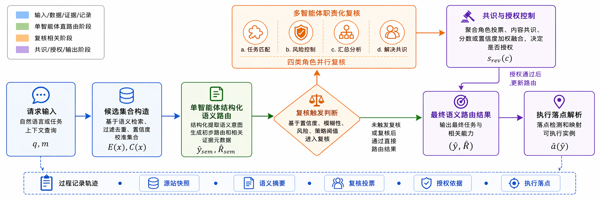
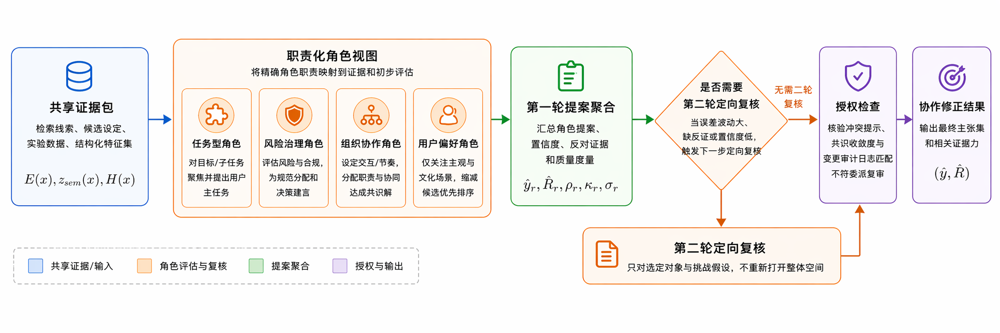

# 面向互联网基础资源的大模型多智能体协作与可信认知标识技术报告

版本：技术增强版 v1.3  
日期：2026年5月17日  
项目名称：面向互联网基础资源的大模型多智能体协作与可信认知标识技术研究  
项目类型：重点项目  
承研处/所：技术发展所  
项目负责人：邓斯宇  
起止时间：2025年5月-2026年4月  
项目经费：10万元

## 摘要

本项目面向互联网基础资源在智能体时代的新型支撑需求，围绕大模型多智能体协作、可信认知标识和可复核过程记录开展技术研究。随着大模型应用由文本生成扩展到工具调用、服务发现、任务执行和智能体协作，互联网基础资源的支撑对象正在从传统静态资源进一步延伸到可描述、可发现、可调用、可审计的智能体能力。针对该趋势，项目以任务书提出的“观点差异、可信标识、共识生成”和“互联网基础资源相关任务验证”为主线，构建了面向智能体服务组织与调用入口的多智能体协作研究框架。

项目以互联网基础资源中的能力命名、发现、选择和可信调用为抽象对象，选择“智能体能力命名与语义路由”作为代表性验证载体。该场景集中体现能力命名、候选边界、主次意图识别、复杂样本复核和过程留痕等问题，适合检验多智能体协作与可信认知标识技术路线。报告主线仍围绕任务书题目展开，语义路由承担场景验证和原型评测作用；DNS 解析系统建设和生产级服务发现属于后续工程化范围。

项目形成了能力命名空间构建、候选组织、单智能体结构化语义判别、多智能体职责化协作复核、显式授权改判、可信过程记录和执行落点衔接等核心模块；整理形成563条样本的统一评测资产，并冻结划分为训练集450条、测试集113条。在统一测试集上，规则路由基线主标签准确率为78.76%，单智能体结构化语义判别提升至87.61%，加入默认协作复核后达到88.50%；在训练集确定的扩展协作配置下，同一测试集准确率达到92.92%，并实现5次改写全部有效修正、0次误改。相关能力识别、协作消融、后验诊断和调用复杂度代理分析进一步表明，项目方法能够在复杂边界样本中形成受控净修正，并通过结构化轨迹支撑过程解释与错误复盘。

项目已形成原型系统、实验数据、研究报告、论文稿、专利申请与技术交底材料、成果汇编、宣传稿和图表材料等阶段性成果，整体覆盖任务书提出的原型框架、报告/论文、专利材料和成果展示要求。后续可在更大规模独立样本、跨命名空间验证、运行成本日志、端到端执行联调和业务场景试点等方向继续深化。

关键词：互联网基础资源；大模型；多智能体协作；可信认知标识；能力命名；过程留痕

## 一、项目背景与研究定位

### 1.1 智能体服务对互联网基础资源提出的新需求

互联网基础资源长期承担资源标识、连接、解析和服务发现等基础性功能。随着大模型和智能体系统快速发展，网络服务对象正在由传统网页、应用接口和静态资源，逐步扩展到具有任务理解、工具调用、状态演化和协同执行能力的智能体服务。智能体服务需要被稳定描述、准确发现、可信调用和过程审计。本报告讨论面向互联网基础资源场景的能力组织与可信调用问题；DNS、真实解析目录和生产级服务发现基础设施建设属于后续工程化范围。

互联网基础资源场景中的智能体服务面临三类技术问题。第一，智能体能力需要稳定描述和统一组织，支撑不同来源、不同职责、不同执行边界的服务发现与调用。第二，自然语言请求需要映射到正确的能力入口，尤其需要区分主能力、相关能力和执行落点。第三，智能体决策过程需要保留候选生成、判断依据、复核触发、改判授权和最终输出等过程记录。

本项目聚焦互联网基础资源场景中的智能体能力组织与可信决策问题，构建可组合、可复核、可审计的大模型多智能体协作框架，使智能体能力能够被命名、被选择、被协作复核，并形成可信过程记录。

### 1.2 任务书目标与结项报告聚焦

根据任务书，本项目拟基于大模型构建具备观点差异、可信标识与共识生成能力的多智能体协作研究框架，探索其在内容理解与任务决策中的结构范式与演化机制，为面向互联网基础资源场景的国产智能系统提供原型基础与方法支撑。任务书将研究内容概括为四个层面：

一是框架实现层面，设计多视角认知风格生成、共识演化机制和智能体行为可信标识机制，形成可组合的多智能体协作研究框架，支撑任务演示、评估与成果展示。

二是技术机制层面，围绕用户代理反馈与协同演化机制，构建多轮意见交互、偏好驱动和群体观点融合过程，推动多智能体的观点融合与自学习能力演化。

三是应用适配层面，在真实标签反馈约束下验证多智能体框架的稳定性、可控性和可解释性，挖掘落地推广潜力。

四是成果凝练层面，完成发明专利、研究报告或论文、对内成果展示或汇报演示等成果要求。

本技术报告围绕任务书目标展开，主线聚焦“大模型多智能体协作与可信认知标识”。报告重点说明协作框架、可信过程记录、互联网基础资源场景验证和考核指标完成情况。智能体能力命名与语义路由作为典型验证场景，服务于项目总体技术目标。

### 1.3 典型验证场景的选择说明

在项目实施过程中，团队选择“智能体能力命名与语义路由”作为互联网基础资源场景下的典型验证载体，主要基于三点考虑。

第一，该场景承接互联网基础资源的核心特征。能力命名、能力发现、语义寻址和服务调用入口，对应命名、解析、发现和连接支撑能力。项目通过受限能力命名空间，将智能体能力组织成可比较、可评测、可调用的地址对象。

第二，该场景集中体现多智能体协作需求。自然语言请求常常包含主次意图混合、层级粒度竞争、跨域重叠和风险边界等问题。项目设置任务匹配、治理风险、层级解析和用户偏好等角色，在复杂样本上形成差异化复核和共识生成。

第三，该场景便于形成真实标签反馈约束下的量化验证。项目可以围绕能力命名空间构建样本、标注主能力和相关能力，进而比较规则方法、单智能体结构化判别、多智能体协作复核和不同授权配置的效果。这使任务书中“稳定性、可控性、可解释性”的要求能够通过数据、实验、消融和轨迹记录得到支撑。

论文侧成果聚焦“受限能力命名空间下的语义路由方法”。本技术报告回到任务书题目，将该方法作为项目总体技术路线的场景化验证结果。

## 二、研究目标与总体技术思路

### 2.1 总体研究目标

本项目总体目标是构建一套面向互联网基础资源场景的大模型多智能体协作与可信认知标识技术框架，使系统能够围绕复杂语义任务完成能力组织、结构化判断、职责化复核、共识形成和过程留痕。具体目标包括：

1. 构建面向智能体服务的能力组织与地址表达方式，使不同能力能够在统一命名空间中被描述、被候选化和被比较。
2. 构建多智能体协作决策框架，使系统能够在直接判断证据不足时引入不同职责角色进行复核，并通过共识机制形成受控修正。
3. 构建可信认知标识与过程记录机制，使候选生成、模型判断、协作复核、授权改判和执行衔接形成可回放、可解释、可审计的轨迹。
4. 在互联网基础资源相关典型场景中完成原型验证，通过真实标签样本、冻结评测协议和消融分析说明方法有效性。
5. 形成结项所需的原型系统、实验资产、技术报告或论文、专利材料和成果展示支撑材料。

### 2.2 总体技术路线

项目总体技术路线可概括为“能力命名与候选组织 -> 单智能体结构化判别 -> 多智能体职责化复核 -> 显式授权与共识形成 -> 可信过程记录 -> 执行落点衔接”。

能力命名与候选组织阶段负责将分散的智能体能力整理为统一命名空间，形成候选集合和候选证据包。该阶段对应互联网基础资源中“命名、发现、组织”的基础作用。

单智能体结构化判别阶段负责在候选集合内部完成主能力选择、可接受层级回落判断、相关能力识别和不确定性摘要。模型围绕固定候选集合输出结构化证据，保证结果可约束、可解释、可复核。

多智能体职责化复核阶段负责处理低置信、高风险、层级冲突和多意图混合样本。系统设置任务匹配、治理风险、层级解析、用户偏好等角色，使不同角色从各自职责角度对同一候选集合进行复核。

显式授权与共识形成阶段负责控制最终改判边界。协作复核先形成候选级证据分数，再依据票数、证据强度、共识增益和风险确认条件决定是否替换直接判断结果。

可信过程记录阶段负责将候选快照、规则分数、模型结构化输出、角色提案、协作聚合、授权判断和执行接口信息统一落盘，形成可复盘、可解释、可核验的技术基础。

执行落点衔接阶段负责在能力地址已经确定后，将其映射到具体可执行实例。该阶段保持语义路由结果稳定，不在执行层重新改写能力地址，从而使“做什么”和“由谁做”保持边界清晰。

### 2.3 与任务书“三阶段路径”的对应关系

任务书提出“大模型异质内容生成 -> 多智能体交互与共识算法 -> 智能体行为可信标识”的三阶段科研路径。项目实际实施与该路径具有明确对应关系。

在“大模型异质内容生成”方面，项目通过结构化语义判别和职责化角色提示，使模型围绕同一候选集合生成不同职责视角下的判断证据。不同角色分别关注主任务承接、风险边界、层级粒度和用户偏好。

在“多智能体交互与共识算法”方面，项目实现了协作触发、角色并行复核、候选级证据聚合、必要时二轮复核和显式授权改判。系统将“是否触发复核”和“是否允许改判”拆开管理，避免协作过程失控。

在“智能体行为可信标识”方面，项目将可信认知标识落实为能力标识符、角色标识符、决策标识符、轨迹标识符及其绑定记录。当前实现重点是工程可审计和过程可核验，为后续进一步引入 DID、可验证凭证、哈希链、签名或篡改检测机制预留结构基础。

## 三、技术目标与任务书对应关系

本报告是技术报告，正文重点说明项目形成的技术框架、关键方法、实验验证和工程实现。本章从技术目标角度说明任务书要求与后续章节的对应关系。项目管理、经费执行、正式展示记录等内容可在验收报告或附件材料中补充。

| 任务书技术要求 | 本报告对应内容 | 技术支撑章节 |
|---|---|---|
| 构建多智能体协作原型框架，具备生成、选择、共识模块 | 形成能力命名空间、候选组织、结构化判别、职责化协作复核、授权改判和过程记录链路 | 第二章、第四章、第七章 |
| 多视角认知风格生成与异质表达 | 设置任务匹配、治理风险、层级解析、用户偏好等职责角色，使不同角色围绕同一候选集合形成差异化判断证据 | 第四章 |
| 多智能体交互与共识算法 | 实现协作触发、角色提案、候选级证据聚合、必要时二轮复核和显式授权改判 | 第四章、第六章 |
| 智能体行为可信标识机制 | 将候选快照、角色标识、结构化判别、复核提案、授权判断和最终输出沉淀为可回放过程记录 | 第四章、第七章 |
| 真实标签反馈约束下的稳定性、可控性、可解释性验证 | 构建563条样本的统一评测资产，冻结train=450/test=113协议，开展主结果、相关能力、协作配置、消融和后验诊断分析 | 第五章、第六章 |
| 互联网基础资源相关典型任务验证 | 以智能体能力命名与能力地址选择作为典型验证载体，验证多智能体协作与可信过程记录机制 | 第一章、第五章、第六章 |

以上对应关系说明，本项目技术报告主体围绕三项问题展开：多智能体协作框架如何构建，可信认知标识如何落地，典型互联网基础资源任务如何验证。语义路由相关内容承担技术验证载体作用，服务于任务书中的大模型多智能体协作与可信认知标识总体目标。

## 四、系统框架与关键技术

### 4.0 总体架构与技术对象

项目总体架构围绕“互联网基础资源中的智能体能力如何被命名、被发现、被复核、被可信记录”展开。系统将能力命名、候选边界、结构化语义判断、多角色复核、授权改判、过程轨迹和执行接口组织为一条可运行链路。

图1展示了系统从用户请求进入能力命名空间，到候选集合生成、规则快路径、单智能体结构化判别、多智能体职责化复核、可信过程记录和执行落点衔接的总体流程。该架构包含两个核心设计原则：语义判断限定在固定候选集合内，协作复核按触发条件启动并通过显式授权控制改判。

### 4.1 技术对象与问题定义

设智能体能力命名空间为 $N=\{c_1,c_2,\ldots,c_M\}$，其中每个能力节点 $c_i$ 包含能力地址、节点描述、别名、层级关系、场景标签和执行约束。输入请求记为 $x=(q,m)$，其中 $q$ 表示用户自然语言请求，$m$ 表示上下文元信息。系统输出定义为：

$$
F(x)=\bigl(\hat y(x),\hat R(x),\hat a(x)\bigr)
$$

其中，$\hat y(x)\in N$ 表示主能力地址，$\hat R(x)\subseteq N\setminus\{\hat y(x)\}$ 表示相关能力集合，$\hat a(x)$ 表示在主能力地址下选择的执行实例。本项目当前重点评价主能力选择和相关能力识别，执行实例选择作为原型系统的下游接口输出，用于说明语义判断如何衔接实际服务调用。

项目采用候选内决策约束。记候选集合构造模块输出为 $C(x)\subseteq N$，则要求：

$$
\hat y(x)\in C(x),\qquad \hat R(x)\subseteq C(x)\setminus\{\hat y(x)\}
$$

候选内约束是可信认知标识的基础。固定候选边界为规则判断、模型判断、角色复核和最终授权提供同一参照对象，也使样本级复盘能够定位候选召回、候选内语义选择、协作授权和执行落点等错误来源。

### 4.2 能力命名空间与地址表达机制

项目构建面向智能体服务的能力命名空间，从能力域、能力节点、节点描述、别名、层级关系、场景标签和执行约束等维度统一表达智能体能力。该命名空间是研究原型内部的实验性能力目录，用于约束候选、支撑评测和复核；公共互联网命名或解析基础设施建设属于后续工程化范围。

项目在地址表达上区分能力地址和实例地址。这里的“地址”是能力目录中的逻辑标识，用于表达能力类别和原型系统内的执行落点；DNS 域名、真实注册资源和生产服务入口属于外部基础设施对象。能力地址表示“哪一类能力应当承接该请求”，实例地址表示“最终由哪个具体实例执行该能力”。该分层设计将语义判断和运行时实例选择分开，也便于在过程记录中区分能力选择错误、候选召回错误和执行落点错误。

该机制为多智能体协作提供共同讨论对象。候选能力经过统一命名并固定在明确集合内，不同智能体角色可以围绕同一组对象进行判断和复核，可信过程记录也具备可比较和可回放基础。

### 4.3 候选组织与规则快路径

候选组织阶段依据节点描述、别名、层级位置、场景标签和上下文信号构造候选集合。系统采用候选内决策原则：下游模型和协作角色在候选集合内部进行主能力选择和相关能力识别，禁止生成候选外能力。

规则快路径负责为常规样本提供低成本基础判断。该模块综合别名匹配、描述相似度、上下文命中、层级支持、粒度适配和结构性惩罚等信号，为候选能力生成可解释分数，并向后续大模型判断提供稳定边界、基础排序和可解释对照。

规则快路径的候选级主任务分数可表示为：

$$
\begin{aligned}
s_{\mathrm{rule}}(c\mid x)=&\;\omega_r \tilde{s}_C(c)+\omega_p \phi_{\mathrm{pri}}(c)+\omega_c \phi_{\mathrm{ctx}}(c)\\
&+\omega_h \phi_{\mathrm{hier}}(c)+\omega_s \phi_{\mathrm{spec}}(c)-\Pi_{\mathrm{struct}}(c)
\end{aligned}
$$

其中，$\tilde{s}_C(c)$ 表示候选集合构造阶段形成的候选优先级，$\phi_{\mathrm{pri}}$、$\phi_{\mathrm{ctx}}$、$\phi_{\mathrm{hier}}$ 和 $\phi_{\mathrm{spec}}$ 分别表示主任务命中、上下文匹配、层级支持和粒度适配信号，$\Pi_{\mathrm{struct}}$ 表示结构性惩罚项。该分数既作为规则基线结果，也作为后续结构化语义判别的可解释输入。

通过规则快路径，项目能够将复杂系统拆解为“候选是否召回”和“候选内是否选对”两个问题。这样既便于实验比较，也便于错误归因和后续优化。

### 4.4 单智能体结构化语义判别

单智能体结构化语义判别是项目形成主要性能增益的核心环节。该模块读取候选说明包，在固定候选集合内部输出主能力候选、相关能力候选、任务匹配度、主能力匹配度、粒度判断、风险失配、不确定性摘要和竞争候选说明等结构化字段。

结构化语义判别将模型输出拆解为可复核字段。模型需要给出主任务、主能力选择依据、竞争候选未选原因、层级粒度问题、高风险提示和多意图冲突等信息。这些字段服务当前判断，也为后续多智能体复核提供语义交接材料。

结构化语义判别输出可表示为：

$$
z_{\mathrm{sem}}(x)=\bigl(\hat y_{\mathrm{sem}},\hat R_{\mathrm{sem}},s_{\mathrm{sem}},H(x),J(x)\bigr)
$$

其中，$\hat y_{\mathrm{sem}}$ 表示单智能体判断的主能力，$\hat R_{\mathrm{sem}}$ 表示相关能力集合，$H(x)$ 编码场景摘要、主任务摘要、不确定性摘要和混淆点，$J(x)$ 表示候选级结构化判断表。随后，系统将规则分数与结构化语义字段进行候选内融合：

$$
\begin{aligned}
s_{\mathrm{sem}}(c\mid x)=&\;\alpha_1 \widetilde{s}_{\mathrm{rule}}(c)+\alpha_2 \widetilde{s}_C(c)+\alpha_3 f_{\mathrm{task}}(c)\\
&+\alpha_4 f_{\mathrm{pri}}(c)+b_{\mathrm{sel}}(c)-\delta_{\mathrm{risk}}(c)
\end{aligned}
$$

其中，$\widetilde{s}_{\mathrm{rule}}$ 为规则主路由分数归一化结果，$\widetilde{s}_C(c)$ 为候选构造阶段优先级的归一化结果，$f_{\mathrm{task}}$ 和 $f_{\mathrm{pri}}$ 分别对应任务匹配度和主能力匹配度，$b_{\mathrm{sel}}$ 奖励被显式选为主能力的候选，$\delta_{\mathrm{risk}}$ 表示风险失配惩罚。

结构化输出的主要字段如下。

| 字段 | 含义 | 作用 |
|---|---|---|
| `selected_primary_fqdn` | 选定主能力地址 | 作为候选内主能力判断结果 |
| `selected_related_fqdns` | 相关能力地址集合 | 识别辅助诉求、前后置依赖和多意图能力 |
| `scene_summary` | 场景摘要 | 向协作复核传递请求背景 |
| `primary_rationale` | 主能力选择依据 | 解释为何选定当前能力 |
| `challenger_notes` | 竞争候选说明 | 标记主要混淆对象和未选择原因 |
| `uncertainty_summary` | 不确定性摘要 | 作为协作触发和复核重点依据 |
| `confusion_points` | 混淆点 | 定位层级、跨域或主次意图冲突 |
| `risk_flags` | 风险标记 | 提供治理风险角色复核依据 |
| `override_sensitivity` | 改判敏感度 | 指示是否需要更强授权证据 |

在工程实现上，该阶段采用结构化 JSON 输出，并将主能力与相关能力输出限制在候选集合内部。项目实践表明，候选内结构化比较比开放式生成更适合互联网基础资源这类需要稳定边界、可解释输出和后续审计的任务。

### 4.5 多智能体职责化协作复核

多智能体协作复核用于处理直接判断证据不足的复杂样本。项目将协作复核设计为职责化、条件化、受控化机制，按触发条件启动，按授权条件改判。

当前协作角色主要包括四类：

| 角色 | 关注重点 | 作用 |
|---|---|---|
| 任务匹配角色 | 主任务、候选描述、显式任务证据 | 判断哪个能力最能直接承接主任务 |
| 治理风险角色 | 风险标签、跨域竞争、负向证据 | 阻止高风险误判和不充分改判 |
| 层级解析角色 | 父子层级、同层竞争、粒度适配 | 处理父子节点和同层能力之间的粒度冲突 |
| 用户偏好角色 | 次要诉求、相关能力、主次意图线索 | 区分主任务与辅助诉求，辅助相关能力识别 |

四类角色共享同一候选集合，并从不同证据视角进行判断。协作控制器聚合角色提案、角色置信度、候选投票比例、单智能体语义分数、显式主任务证据和职责信号，形成候选级复核分数。对于候选差距过小、高风险或跨层级改判样本，系统可以触发第二轮定向复核。

对每个角色 $r\in R$，系统构造角色专属视图 $P_r(x)$，并输出角色提案：

$$
o_r(x)=\bigl(\hat y_r,\hat R_r,\rho_r,\kappa_r,\sigma_r\bigr)
$$

其中，$\hat y_r$ 表示角色建议的主能力，$\hat R_r$ 表示角色建议的相关能力，$\rho_r$ 表示角色置信度，$\kappa_r$ 表示是否支持改判，$\sigma_r$ 表示职责维度上的支持、阻止或中性信号。控制器在第一轮聚合角色提案后计算候选级复核分数：

$$
\begin{aligned}
s_{\mathrm{rev}}^{(1)}(c\mid x)=&\;0.40v(c)+0.25\bar{\rho}(c)+0.15s_{\mathrm{sem}}(c)\\
&+0.10e(c)+0.10r(c)+\zeta(c)
\end{aligned}
$$

其中，$v(c)$ 表示把候选 $c$ 作为主能力的角色比例，$\bar{\rho}(c)$ 表示相应角色平均置信度，$e(c)$ 表示显式证据强度，$r(c)$ 表示相关能力投票比例，$\zeta(c)$ 表示职责信号的加权和。

协作复核的核心流程可概括为以下算法。

算法1 职责化协作复核与授权改判

输入：请求 $x$，候选集合 $C(x)$，单智能体结果 $z_{\mathrm{sem}}(x)$。

1. 根据置信度、候选间隔、风险标记和多意图线索判断是否触发复核。
2. 若不触发复核，返回 $z_{\mathrm{sem}}(x)$ 作为最终语义判断结果。
3. 为任务匹配、治理风险、层级解析、用户偏好角色构造职责视图。
4. 并行生成角色提案 $o_r(x)$，包括主能力、相关能力、置信度和改判意见。
5. 聚合候选级投票、平均置信度、显式证据和职责信号，形成复核分数。
6. 若候选差距过小或涉及敏感改判，触发第二轮定向复核。
7. 若改判候选满足票数、增益、证据和风险确认门槛，则授权改判。
8. 否则保留单智能体结构化语义判别结果。

输出：最终主能力、相关能力、复核记录和授权结果。

该机制对应任务书中“观点差异”和“共识生成”的要求。不同角色提供差异化判断，共识控制器负责收敛和授权，最终结果由证据聚合和约束检查共同决定。

### 4.6 显式授权改判机制

项目将“是否复核”和“是否改判”拆分为两个独立判断。样本进入协作复核后，系统先形成复核证据，再根据授权规则决定是否改判。

授权条件主要包括：改判候选获得足够角色支持；候选级复核分数相对直接判断有足够增益；存在明确主任务证据；高风险、跨域或跨层级改判需要更强证据和二轮复核确认。授权条件外的样本保留单智能体结构化判断结果。

显式授权机制把多智能体协作落实为复杂样本上的审查和纠错流程。实验中扩展配置取得5次改写、5次纠错、0次误改，说明职责化证据与授权边界配合后，可以在复杂样本上形成低误改的净修正。

### 4.7 可信认知标识与过程记录

本项目将“可信认知标识”定义为一组可引用的标识符及其绑定记录。标识符首先是字符串或结构化 ID，用于指向能力、角色、一次判断、一次复核、一次完整轨迹和执行落点；绑定记录保存该标识符对应的候选、证据、分数、角色意见、授权结果和执行信息。当前原型采用工程化字符串标识和结构化记录，DID、可验证凭证、签名和哈希链可作为后续增强方向。

系统对每条样本记录候选集合、规则分数、结构化语义判别结果、升级原因、角色提案、复核聚合、授权判断、最终输出和执行接口信息。这些记录支撑候选来源追踪、直接判断解释、协作触发说明、角色意见核查、改判授权核查和错误来源定位。

可信认知标识在当前原型中落实为以下标识符和绑定记录。

| 标识符类型 | 标识符形式 | 绑定记录与可信作用 |
|---|---|---|
| 能力标识符 | 能力地址字符串或能力节点编号 | 绑定节点描述、层级关系和候选快照，明确系统在什么候选边界内决策 |
| 角色标识符 | 任务匹配、治理风险、层级解析、用户偏好等角色 ID | 绑定角色视图、角色提案和置信度，明确意见来源和职责边界 |
| 决策标识符 | 样本 ID + 阶段 ID 或决策 ID | 绑定规则分数、语义判别字段和主/相关能力结果，明确一次判断如何形成 |
| 复核标识符 | 复核轮次 ID 或角色提案 ID | 绑定角色提案、复核分数、二轮确认和授权结果，明确协作改判依据 |
| 轨迹标识符 | trace ID 或过程记录 ID | 串联候选、判断、复核、授权和最终输出，支撑样本级回放和审计 |
| 执行标识符 | 实例 ID 或执行落点 ID | 绑定实例候选、过滤原因和排序分数，明确语义判断如何衔接执行落点 |
| 后续可信增强 | DID、可验证凭证、哈希链、签名等 | 将上述标识符与记录绑定到可跨系统核验、防篡改的证明机制 |

统一过程轨迹可表示为：

$$
T(x)=\bigl(E(x),z_{\mathrm{rule}}(x),z_{\mathrm{sem}}(x),g(x),\{o_r(x)\}_{r\in R},z_{\mathrm{rev}}(x),\hat a(x)\bigr)
$$

其中，$E(x)$ 表示候选快照，$z_{\mathrm{rule}}(x)$ 表示规则快路径输出，$g(x)$ 表示协作触发信号，$z_{\mathrm{rev}}(x)$ 表示复核聚合与授权结果。过程记录的主要字段如下。

| 记录对象 | 主要字段 | 支撑的审计问题 |
|---|---|---|
| 候选快照 | 候选地址、候选描述、规则分数、层级关系 | 候选是否召回、候选边界是否固定 |
| 结构化判别 | 主能力、相关能力、候选级理由、混淆点 | 单智能体为何这样判断 |
| 协作触发 | 置信度、候选间隔、风险标记、多意图线索 | 为什么进入或不进入复核 |
| 角色提案 | 角色身份、角色视图、角色建议、置信度 | 哪些职责支持或阻止改判 |
| 授权结果 | 票数、增益、证据强度、风险确认 | 改判是否满足显式门槛 |
| 执行接口 | 主能力地址、实例候选、过滤原因、排序分数 | 能力选择如何衔接执行落点 |

过程记录机制将可信认知标识落实为可操作的数据结构和审计材料，支撑实验分析、结项答辩、成果展示和后续系统治理。

### 4.8 执行落点解析与原型联动

能力地址确定后，系统进入下游执行实例衔接阶段。项目实现执行落点解析模块，在主能力地址既定的前提下，从实例集合中筛选可执行对象。该模块遵循四项原则：接受与主能力地址精确匹配的实例；保持上游能力地址稳定；硬过滤离线、缺失 endpoint 或 schema 不兼容实例；采用可解释评分函数排序候选实例。

执行实例选择评分函数为：

$$
\mathrm{final}(a)=\mathrm{base}(a)\cdot \mathrm{health}(a)\cdot \mathrm{fair}_{\mathrm{agent}}(a)\cdot \mathrm{fair}_{\mathrm{provider}}(a)
$$

其中：

$$
\mathrm{base}(a)=0.55S_{\mathrm{match}}(a)+0.25S_{\mathrm{schema}}(a)+0.20S_{\mathrm{tag}}(a)
$$

该评分将能力匹配、schema 兼容、服务标签、健康度和公平曝光纳入同一排序过程，并通过硬过滤保证语义路由结果不被执行层重新改写。

执行落点解析是原型系统链路的一部分，用于说明语义判断结果如何进入服务调用流程。项目已重点验证能力地址选择、相关能力识别和协作复核机制；执行实例选择已形成原型模块和接口约束，后续结合真实运行环境开展端到端联调。

## 五、数据资产与评测协议

### 5.1 数据集构建

为验证项目方法，团队围绕智能体能力命名与语义路由这一典型场景整理形成563条样本的数据资产，并冻结划分为训练集450条、测试集113条。样本覆盖50个命名空间节点、45类主标签，测试集中约三分之一样本带相关能力标注，同时覆盖主次意图混合、层级粒度竞争、跨域相近能力和治理风险提示等复杂边界类型，用于检验复杂条件下的方法稳定性。

样本标签包括三类：主能力标签、可接受能力集合和相关能力集合。主能力标签用于评价系统是否选对最合适的能力入口；可接受能力集合用于覆盖层级合理回落或等价入口；相关能力集合用于评价系统是否识别出辅助诉求、上下文依赖或协同能力。主次意图混合、治理风险提示等属于样本属性或复核触发线索，正文以整体覆盖情况说明，具体标注数量可随数据说明或附录材料备查。

### 5.2 冻结评测协议

项目采用统一冻结 train/test 协议。训练集用于提示词形式、触发阈值、改判授权门槛和协作配置开发；测试集用于固定配置下的一次性结果报告。该协议统一了结果口径，使结项报告能够清楚说明不同模块的增益来源。

除统一主结果外，项目还开展扩展配置比较、配对协作消融、后验诊断、累计样本池稳定性分析和调用复杂度代理分析。这些分析共同回答三个问题：结构化语义判别是否有效；多智能体协作是否带来净修正；协作收益主要出现在什么类型的样本上。

为便于复核技术实现边界，当前实验和原型实现中的关键参数整理如下。相关参数主要在训练集和开发过程中确定，测试集用于固定配置验证。

| 参数项 | 当前设置 | 说明 |
|---|---:|---|
| 规则快路径候选保留 | top-5 | 用于主能力和相关能力基础排序 |
| 结构化语义判别候选包 | top-8 | 提供更充分的候选比较空间 |
| 相关能力输出上限 | 3 | 避免相关能力集合过宽 |
| 单智能体输出温度 | 0 | 提升结构化输出稳定性 |
| 单智能体最大输出长度 | 1800 tokens | 覆盖理由、竞争候选和风险字段 |
| 协作角色数 | 4 | 任务匹配、治理风险、层级解析、用户偏好 |
| 协作最大轮次 | 2 | 第一轮聚合，必要时第二轮定向复核 |
| 低置信触发阈值 | 0.62 | 低于该值进入复核候选 |
| 普通候选间隔阈值 | 0.08 | top-1 与竞争候选差距不足时触发复核 |
| 高风险间隔阈值 | 0.14 | 高风险样本需要更保守的改判控制 |
| 改判最小支持票 | 3 | 防止少数角色意见直接覆盖初判 |
| 改判分数增益 | 0.08 | 要求复核结果相对直接判断有明确收益 |
| 显式证据强度 | 0.55 | 要求改判具有足够主任务证据 |

### 5.3 评测指标

项目主要使用以下指标：

1. 主标签准确率：衡量系统是否选对主能力。
2. 可接受准确率：允许命中预定义可接受能力，反映层级合理回落情况。
3. 相关能力召回率和精确率：评价辅助能力和相关能力识别质量。
4. 改判/纠错/误改：评价协作复核相对于参考路径改变了多少样本，其中多少是有效纠错，多少是误改。
5. 协作触发率和调用当量：评价协作复核的工程成本和触发范围。
6. 后验诊断分组结果：分析常规样本、困难边界样本和扩展观察样本中的收益分布。

## 六、实验结果与分析

### 6.1 主结果

统一训练/测试协议下的主结果如下。

| 系统 | 训练集主准确率 | 测试集主准确率 | 测试集可接受准确率 | 测试集改判/纠错/误改 |
|---|---:|---:|---:|---|
| 规则路由基线 | 0.8156（367/450） | 0.7876（89/113） | 0.8142 | - |
| 规则路由基线 + 协作复核 | 0.8244（371/450） | 0.8053（91/113） | 0.8319 | 2 / 2 / 0 |
| 单智能体结构化语义判别 | 0.8756（394/450） | 0.8761（99/113） | 0.9027 | - |
| 单智能体结构化语义判别 + 默认协作复核 | 0.8844（398/450） | 0.8850（100/113） | 0.9115 | 1 / 1 / 0 |

结果表明，结构化语义判别形成了项目方法的主要性能台阶。与规则路由基线相比，测试集主标签准确率由78.76%提升至87.61%，可接受准确率由81.42%提升至90.27%。在此基础上加入默认协作复核后，测试集主标签准确率进一步达到88.50%，且未引入误改。

这组结果表明，项目已在真实标签反馈约束下完成可量化验证。规则基线、单智能体结构化判别和多智能体协作复核之间的分层比较，也说明项目能够解释性能提升来自哪个技术环节。

### 6.2 相关能力识别结果

相关能力识别用于衡量系统是否能够识别辅助诉求、上下文相关能力和多意图请求中的配套能力。

| 系统 | 训练集相关召回率 | 训练集相关精确率 | 测试集相关召回率 | 测试集相关精确率 |
|---|---:|---:|---:|---:|
| 规则路由基线 | 0.2822 | 0.3833 | 0.2895 | 0.3793 |
| 单智能体结构化语义判别 | 0.3129 | 0.4080 | 0.3684 | 0.4242 |

测试集上，结构化语义判别将相关能力召回率由28.95%提升至36.84%，相关能力精确率由37.93%提升至42.42%。项目方法提升了主标签选择质量，也增强了对复合任务结构的识别能力。互联网基础资源场景中的智能体服务调用通常包含主任务、辅助任务和上下文依赖，相关能力识别直接影响后续能力编排和调用入口选择。

### 6.3 协作配置与净修正收益

项目进一步比较默认配置、选择性配置和扩展配置三种协作决策方式。三种配置均在训练集上确定，再在同一测试集上固定评估。扩展配置的触发阈值与授权门槛均在训练集确定，测试集仅用于锁定配置后的一次性评估；92.92% 表示冻结测试集上的机制验证结果，生产上线性能需要后续真实环境评估。

| 配置 | 训练集准确率 | 测试集准确率 | 测试集改判/纠错/误改 | 相对默认配置增量 |
|---|---:|---:|---|---:|
| 默认配置 | 0.8800（396/450） | 0.8850（100/113） | - | 0.0000 |
| 选择性配置 | 0.8911（401/450） | 0.8938（101/113） | 1 / 1 / 0 | +0.0088 |
| 扩展配置 | 0.8978（404/450） | 0.9292（105/113） | 5 / 5 / 0 | +0.0442 |

扩展配置在训练集和测试集上均保持最高准确率，并在测试集上实现5次改判、5次纠错、0次误改。结果表明，多智能体协作收益来自职责化证据、触发条件和授权规则之间的配合。默认配置体现高精度保守复核，扩展配置体现更充分的复杂样本修正能力。

### 6.4 协作消融分析

为判断“职责化协作是否比单角色复核或同质复核更有效”，项目在具备完整复核记录的配对消融样本集上开展比较。该样本集训练侧包含320条样本，测试侧包含80条样本。本节为配对消融子集结果，用于说明职责化协作机制的相对贡献，与6.3节全量测试集主结果不作直接数值横向比较。

| 系统 | 训练集准确率 | 训练集改判/纠错/误改 | 测试集准确率 | 测试集改判/纠错/误改 |
|---|---:|---|---:|---|
| 单角色复核 | 0.8875 | 3 / 3 / 0 | 0.8625 | 0 / 0 / 0 |
| 同质复核 | 0.8844 | 2 / 2 / 0 | 0.8625 | 0 / 0 / 0 |
| 职责化协作复核（扩展配置） | 0.9187 | 13 / 13 / 0 | 0.9250 | 5 / 5 / 0 |

结果显示，单角色复核和同质复核在测试侧未超越单智能体结构化判别基线；职责化协作复核在扩展配置下将测试准确率提升至92.50%，并实现5次有效纠错、0次误改。该结果说明职责分工和授权控制是协作收益的关键来源。

### 6.5 后验诊断分析

项目将测试集按评估诊断口径划分为常规样本池、困难边界样本池和扩展观察样本池，用于分析收益分布。诊断样本池按样本难度、错误来源和观察目的形成；“多意图”“高风险”等属于样本属性标签，可能分布在不同诊断样本池中。

| 诊断样本池 | 样本数 | 单智能体结构化判别 | 单智能体结构化判别 + 协作复核 |
|---|---:|---:|---:|
| 常规样本池 | 35 | 0.9143 | 0.9143 |
| 困难边界样本池 | 24 | 0.6250 | 0.6667 |
| 扩展观察样本池 | 54 | 0.8889 | 0.9074 |

结果显示，常规样本池中结构化判别已经达到较高水平，协作复核主要保持该结果；困难边界样本池和扩展观察样本池中，协作复核带来进一步提升。该结果符合项目设计预期：多智能体协作面向复杂、低置信、高风险和多意图样本提供条件化增强。

### 6.6 调用复杂度代理分析

默认配置下，单智能体结构化判别是每个请求的必经基础调用；协作复核只在满足触发条件时启动。测试集中共有50/113个样本进入协作复核，触发率为44.25%；进入协作样本的平均角色调用数为4.72次，第二轮复核占比为18.00%；按调用当量估算，平均每个请求额外增加2.09次协作角色调用，总调用当量约为3.09次/请求。

调用复杂度结果表明，项目方法将协作资源集中用于更可能发生复杂边界问题的样本。后续工程化部署需要补充更完整的 token、时延、接口稳定性和资源消耗日志，形成质量-成本联合评估。

### 6.7 实验结论

综合主结果、相关能力识别、协作配置、配对消融、后验诊断和复杂度分析，项目形成以下结论：

1. 固定候选边界内的结构化语义判别是性能提升的主要来源。
2. 多智能体协作复核在复杂样本上具有净修正价值，但其收益依赖职责分工、结构化证据和授权边界。
3. 可信过程记录能够将结果分析从最终准确率扩展到候选、判断、复核、授权和执行接口等过程环节。
4. 典型场景验证结果支撑任务书提出的“稳定性、可控性、可解释性”研究目标。

## 七、原型系统与工程实现

### 7.1 原型系统组成

项目形成了面向智能体能力命名与协作复核的原型系统。系统覆盖自然语言请求输入、候选集合构造、规则快路径判断、单智能体结构化语义判别、多智能体职责化复核、显式授权改判、结果展示和执行落点衔接等环节。

工程结构方面，原型系统主要由以下功能模块组成：

| 模块 | 作用 |
|---|---|
| 命名空间管理模块 | 命名空间、能力节点和地址对象管理 |
| 候选集合构造模块 | 候选集合构造与召回 |
| 规则快路径模块 | 规则快路径判断 |
| 结构化语义判别模块 | 单智能体结构化语义判别 |
| 协作复核与共识控制模块 | 多智能体协作复核与共识控制 |
| 相关能力识别模块 | 相关能力识别 |
| 执行落点选择模块 | 执行落点选择 |
| 路由链路与服务接口模块 | 路由链路与服务接口 |

配套脚本用于数据构建、样本校验、实验运行、协作复核、评估统计和图表生成。测试用例覆盖候选构造、规则判断、单智能体输出解析、协作复核、相关能力识别和执行选择等模块。代码目录说明、运行截图和演示材料建议作为附件提交。

### 7.2 数据和实验资产

项目数据资产包括正式样本、盲测输入、标签文件、覆盖统计、family 台账、manifest 文件和补充评测集。多意图集合路由评测集已作为后续扩展资产形成，不混入本报告主实验 train/test 口径。相关校验脚本可以验证数据格式、样本覆盖、family 隔离、文本重复和标注字段一致性。

实验输出材料包括统一测试集增益瀑布图、不同配置选择结果、协作消融图、配置敏感性图、执行负载代理图和累计样本池稳定性图。这些材料可作为结项答辩或技术报告附件。

### 7.3 过程记录和可复盘能力

项目原型系统在每个阶段保留结构化输出，包括候选快照、规则分数、模型结构化判断、协作角色提案、二轮复核信息、授权判断和最终结果。通过这些记录，系统可以支持样本级错误分析和案例复盘。

可复盘能力是本项目的重要技术特征。项目关注最终准确率，也关注过程证据是否充分、改判边界是否清楚、错误来源是否可定位。该能力对应任务书中的“可信认知标识”和“过程可控可解释”要求。

## 八、成果产出与考核指标完成情况

### 8.1 考核指标对照

| 任务书考核指标 | 完成情况 | 结项说明 |
|---|---|---|
| 构建1套多智能体协作原型框架，具备生成-选择-共识模块 | 已完成 | 已形成能力命名、候选组织、结构化判别、职责化协作复核、授权改判、过程记录和执行接口衔接的原型链路 |
| 提交至少1项发明专利 | 已形成申请相关材料，正式提交/受理证明待补充 | 已形成专利技术交底书、权利要求书、说明书摘要、附图和申请材料汇编；如已有提交回执或受理号，需在最终稿补充 |
| 提交技术研究报告或论文至少1份 | 已完成 | 已形成技术研究报告、结项技术报告初稿和论文投稿稿，覆盖方法设计、实验协议、评测结果和机制分析 |
| 完成至少1次对内成果展示或汇报演示 | 已形成支撑材料，正式展示证明待补充 | 已形成原型系统、图表、宣传稿、成果汇编和汇报支撑材料；如已有会议纪要、截图或录屏，建议随验收材料补充 |

### 8.2 已形成文档成果

项目已形成以下类型文档和材料：

1. 技术研究报告：对系统框架、方法路线、实验结果和局限性进行总结。
2. 论文投稿稿：围绕受限能力命名空间语义路由问题形成学术化表达。
3. 项目成果汇编：面向成果归档和审阅，系统梳理背景、思路、创新、实验和应用价值。
4. 自立科研项目验收报告：对照项目概况、完成情况、指标达成、经费和证明材料进行填写。
5. 专利申请相关材料：包括技术交底书、权利要求书、说明书摘要、说明书附图和申请材料汇编。
6. 成果宣传材料：包括成果宣传稿、安全公开版宣传稿和相关图示材料。
7. 实验图表材料：包括主结果、配置比较、协作消融、调用复杂度和累计稳定性等图表。

### 8.3 成果材料与证明路径

为便于结项材料归档和评审快速核查，建议按下表组织证明材料。

| 成果类别 | 已形成材料 | 建议证明路径 |
|---|---|---|
| 多智能体协作原型框架 | 原型代码、服务接口、实验脚本、测试用例 | 附件1：原型系统代码目录说明、运行截图或演示录屏 |
| 典型任务场景验证 | 统一评测样本、主结果表、协作消融、后验诊断、复杂度代理 | 附件2：统一评测数据与标签说明；附件3：实验结果与过程记录样例 |
| 技术研究报告或论文 | 技术研究报告、论文投稿稿、本结项技术报告 | 附件4：技术研究报告、论文稿及PDF |
| 发明专利相关材料 | 技术交底书、权利要求书、说明书摘要、说明书附图、申请材料汇编 | 附件5：专利申请材料汇编；正式提交/受理证明待补 |
| 成果展示支撑 | 答辩PPT、成果汇编、宣传稿、图表材料 | 附件6：成果展示PPT、成果汇编、宣传稿和图表材料 |
| 可信过程记录与审计支撑 | 候选快照、结构化判别、协作复核、授权改判和最终输出记录 | 实验产物中的 JSON/JSONL trace、样本级案例和评测脚本 |
| 管理与财务证明 | 项目编号、签订日期、经费支出、内部展示记录等 | 由项目管理部门、财务部门和实际会议/展示记录补充 |

上述材料中，技术实现、实验数据、报告论文、专利文本和宣传材料已有本地文件支撑；专利正式提交/受理、论文正式投稿/录用、内部展示记录、经费决算和外部采用证明等事项，需要以正式管理材料为准。

### 8.4 成果边界说明

本报告对成果状态采用稳健表述。已经由本地材料直接支撑的内容，按“已形成”“已完成”“已实现原型”“已开展实验验证”表述；正式提交、受理、授权、发表、录用、上线、采用等状态以正式证明材料为准。

最终报送版本可补充发明专利提交回执、受理通知或申请号；论文正式投稿、录用或发表证明；对内成果展示会议纪要、演示视频、汇报PPT或现场照片。原型系统按研究原型、离线评测链路、服务接口和演示支撑材料表述；生产上线系统或外部正式采用成果以正式证明为准。项目编号、签订日期、经费实际支出明细、预算执行率和财务票据等管理信息，以项目管理部门和财务部门审核结果为准。

## 九、创新点与技术价值

### 9.1 将多智能体协作落到互联网基础资源任务链路

项目将多智能体协作落到互联网基础资源相关的能力命名、服务发现、语义寻址和可信调用链路中。典型场景验证表明，大模型多智能体协作可以支撑受控候选决策、复杂样本复核和过程留痕。

### 9.2 提出结构化语义判别与职责化复核结合的技术路线

项目以单智能体结构化判别作为主判断基础，以多智能体协作作为复杂样本的条件化复核机制。该路线结合规则边界、结构化语义证据和职责化复核，提升准确率和可解释性。

### 9.3 以显式授权机制控制协作改判边界

项目提出协作触发和最终改判解耦机制。多智能体复核提供证据和候选挑战，授权规则控制最终改判。该机制降低误改风险，并使协作收益可以通过“改判/纠错/误改”指标直接评估。

### 9.4 将可信认知标识落实为可回放过程记录

项目将可信认知标识具体化为候选快照、角色身份、模型版本、结构化判断、协作提案、授权结果和执行接口记录。该做法使系统具备样本级复盘能力，也为后续引入更强的审计、签名、哈希链或标准化接口提供基础。

### 9.5 形成可复用的数据、实验和成果组织方式

项目形成统一冻结评测资产、标注字段、评测指标、消融协议和图表输出。该组织方式不仅支撑本次结项，也可为后续智能体互联网、AgentDNS、能力发现和可信服务调用等工作提供方法基础。

## 十、应用价值与推广前景

### 10.1 支撑智能体互联网中的能力发现与调用入口

随着智能体服务数量增加，如何发现能力、选择能力、调用能力将成为智能体互联网基础设施的重要问题。项目形成的能力命名、候选组织、结构化判断和执行衔接机制，可为智能体服务调用入口提供参考。

### 10.2 支撑复杂语义任务中的可信决策

互联网基础资源相关任务往往具有治理边界、风险约束和责任要求。项目通过职责化协作复核和显式授权机制，使复杂样本的改判过程有据可查、有边界可控，有助于支撑审核辅助、服务发现、能力编排和智能合规等场景。

### 10.3 支撑后续标准化表达和平台化建设

能力命名、角色标识、过程记录、评测协议和审计字段都具有进一步标准化潜力。后续可围绕智能体能力描述、发现接口、可信轨迹格式、协作复核协议和运行日志规范开展延伸研究。

### 10.4 支撑成果转化和持续研究

项目已经形成原型系统和较完整的成果材料。后续可在更大规模样本、更广业务场景、不同模型后端和真实服务调用环境中继续验证，推动从研究原型向工具化平台、演示系统或业务试点延伸。

## 十一、存在问题与后续工作

### 11.1 存在问题

第一，当前样本规模能够支撑方法比较和机制分析；更大范围部署需要更多来源、更广覆盖、更独立的验证样本。

第二，当前实验已使用调用复杂度代理刻画成本；真实运行中的 token、时延、接口稳定性、失败恢复和资源消耗日志需要进一步统一记录。

第三，执行落点解析已形成原型模块和接口约束；完整运行环境、业务系统和端到端服务调用链路联调需要继续推进。

第四，当前可信过程记录主要是工程可审计、可复盘层面的可信，后续如面向更强安全场景，还需要补充签名、哈希链、访问控制和篡改检测等机制。

### 11.2 后续工作

后续建议围绕四个方向展开：

1. 扩展独立验证样本和能力命名空间，检验方法在更多业务语义和动态能力目录中的稳定性。
2. 完善质量、成本、时延和运行稳定性日志，形成面向部署场景的综合评估体系。
3. 推进执行落点解析与真实服务调用环境联调，补充端到端任务成功率、失败恢复和用户确认机制。
4. 深化可信认知标识机制，将当前结构化过程记录扩展为更规范的审计链、证明链和标准化接口。

## 十二、结论

本项目围绕“面向互联网基础资源的大模型多智能体协作与可信认知标识技术研究”任务书要求，构建了面向智能体服务组织与调用入口的多智能体协作研究框架。项目以能力命名、结构化语义判断、职责化协作复核、显式授权改判和可信过程记录为核心，完成了从问题定义、原型实现、数据构建、实验验证到成果凝练的完整链路。

在典型互联网基础资源验证场景中，项目整理形成563条样本的统一评测资产，并通过冻结训练/测试协议验证了方法效果。实验结果显示，结构化语义判别显著提升主能力判断和相关能力识别质量；职责化多智能体协作复核在复杂样本上形成低误改净修正；过程记录机制支撑样本级回放、解释和审计。项目形成了与任务书目标相匹配的“多智能体协作 + 可信过程记录 + 互联网基础资源场景验证”技术闭环。

项目已形成原型系统、实验数据、研究报告/论文、专利申请相关材料、成果汇编、宣传稿和图表材料等成果，整体满足结项技术报告所需的主要支撑条件。后续可在更大规模独立验证、端到端联调、运行成本记录和可信轨迹标准化等方向继续深化，为智能体互联网、能力发现、可信调用和互联网基础资源智能化演进提供技术基础。

## 参考文献与参考材料

### 外部参考文献

1. Chen W, You Z, Li R, et al. Internet of Agents: Weaving a Web of Heterogeneous Agents for Collaborative Intelligence. ICLR, 2025.
2. Guo S, Wang Y, Su Z, Pan Y, Hu Q, Luan T H. Agent Discovery in Internet of Agents: Challenges and Solutions. IEEE Network, 2026. doi:10.1109/MNET.2026.3663837.
3. Huang K, Narajala V S, Habler I, Sheriff A. Agent Name Service (ANS): A Universal Directory for Secure AI Agent Discovery and Interoperability. arXiv preprint arXiv:2505.10609, 2025.
4. Yao S, Zhao J, Yu D, et al. ReAct: Synergizing Reasoning and Acting in Language Models. ICLR, 2023.
5. Schick T, Dwivedi-Yu J, Dessi R, et al. Toolformer: Language Models Can Teach Themselves to Use Tools. NeurIPS, 2023.
6. Patil S G, Zhang T, Wang X, Gonzalez J E. Gorilla: Large Language Model Connected with Massive APIs. NeurIPS, 2024.
7. Qin Y, Liang S, Ye Y, et al. ToolLLM: Facilitating Large Language Models to Master 16000+ Real-world APIs. ICLR, 2024.
8. Li M, Zhao Y, Yu B, et al. API-Bank: A Comprehensive Benchmark for Tool-Augmented LLMs. In Proceedings of EMNLP 2023, 3102-3116.
9. Patil S G, Mao H, Yan F, Ji C C, Suresh V, Stoica I, Gonzalez J E. The Berkeley Function Calling Leaderboard (BFCL): From Tool Use to Agentic Evaluation of Large Language Models. In Proceedings of ICML 2025, PMLR 267:48371-48392.
10. Ong I, Almahairi A, Wu V, Chiang W L, Wu T, Gonzalez J E, Kadous M W, Stoica I. RouteLLM: Learning to Route LLMs from Preference Data. ICLR, 2025.
11. Du Y, Li S, Torralba A, Tenenbaum J B, Mordatch I. Improving Factuality and Reasoning in Language Models through Multiagent Debate. In Proceedings of ICML 2024, PMLR 235:11733-11763.
12. Wang Q, Wang Z, Su Y, Tong H, Song Y. Rethinking the Bounds of LLM Reasoning: Are Multi-Agent Discussions the Key? In Proceedings of ACL 2024, Volume 1: Long Papers, 6106-6131.

### 项目参考材料与备查附件

1. 自立科研项目任务书。
2. 自立科研项目验收报告。
3. 项目成果汇编。
4. 技术研究报告。
5. 论文稿及配套图表材料。
6. 统一评测数据与标签说明。
7. 原型系统代码目录说明。
8. 实验脚本、评测脚本和测试用例说明。
9. 实验结果图表、过程记录样例和样本级复盘材料。
10. 专利申请材料汇编。
11. 成果展示PPT、宣传稿和会议证明材料。

## 附录：建议随结项提交或备查的材料

1. 自立科研项目任务书。
2. 本结项技术报告。
3. 技术研究报告、论文稿及PDF。
4. 原型系统说明、代码目录说明、运行截图或演示材料。
5. 实验数据说明、评测结果表、图表材料和样本校验报告。
6. 发明专利申请材料、技术交底书、权利要求书、说明书摘要和附图。
7. 成果汇编、成果宣传稿、安全公开版宣传稿。
8. 对内成果展示或汇报证明材料，如PPT、会议纪要、录屏或现场照片。
9. 项目管理、展示证明、财务决算等非技术证明材料，由验收报告或附件材料另行补充。
